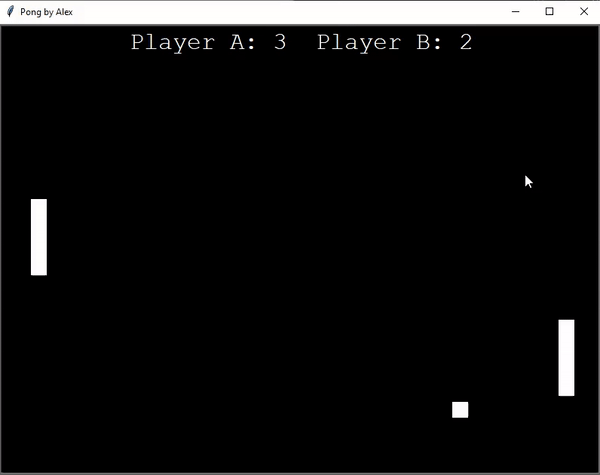

# Pong
To expose myself to Python, I decided to make this simple Pong game following an online tutorial. Definitely a good introduction to Python!
Made use of Turtle libraries for the object, OS and Winsound for bouncing sound effects.

W, S for player A. Up, down arrowkeys for player B.

  

