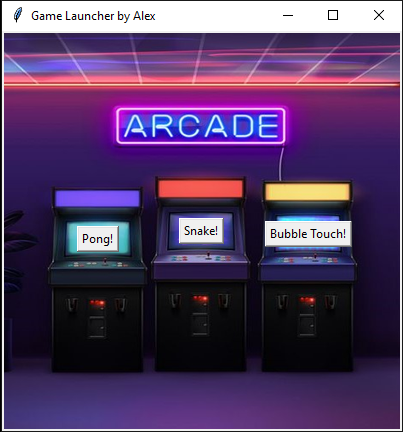

# PythonGames
Games made with Python to learn Python. Also included a GUI launcher to make it feel like a retro arcade. GUI is done with tkinter and the games are mostly done with turtle module.

  
  

